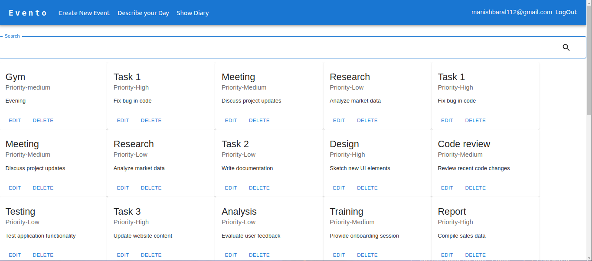

## This is the client side application for a event management application

### MaterialUI based User Interface

## Features:

### Login

### Register-(Stepper Form- Formik)

### Create Event-(Dynamic Form, Formik-FieldArray)

### Read the Event

### Edit the Event-(Dialogue Based Event Editor)

### Delete The Event

