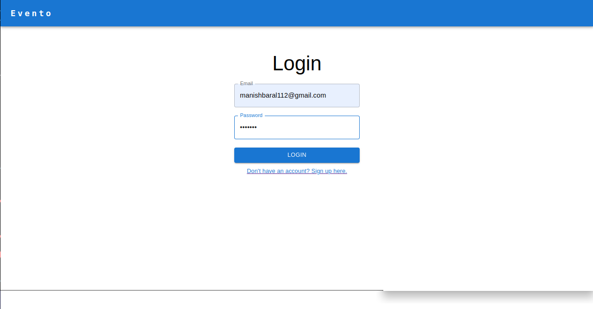

## This is the client side application for a event management application

The backend is written in nestJs and is available here
https://github.com/K-adu/EventManagement-Server-Side

## MultiStep Signup (Formik)

## Login Page

## HomePage

## Search Functionality

## Dynamic Form(Formik)

## Editing and Deleting the events

## TinyMCE Text Editor

## Rendering styles

